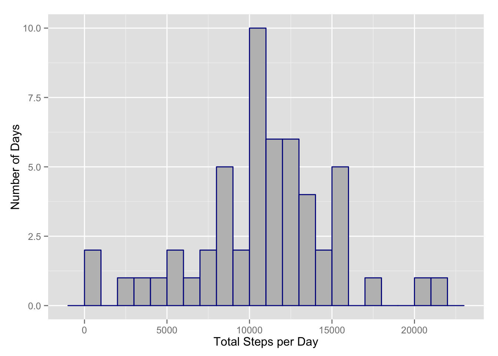
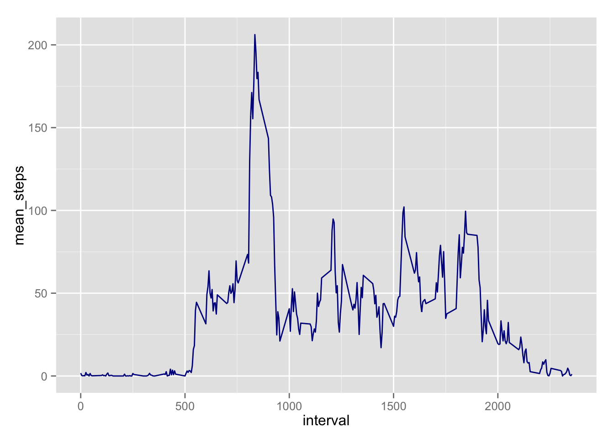
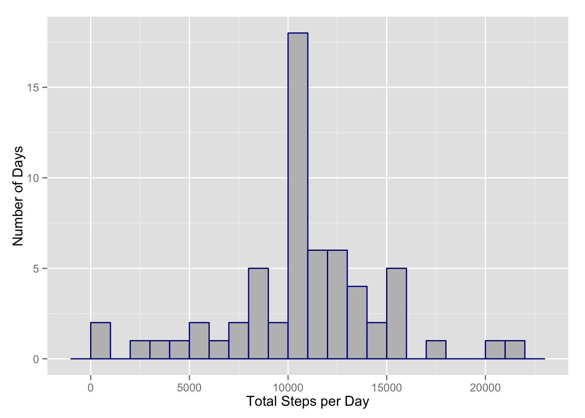
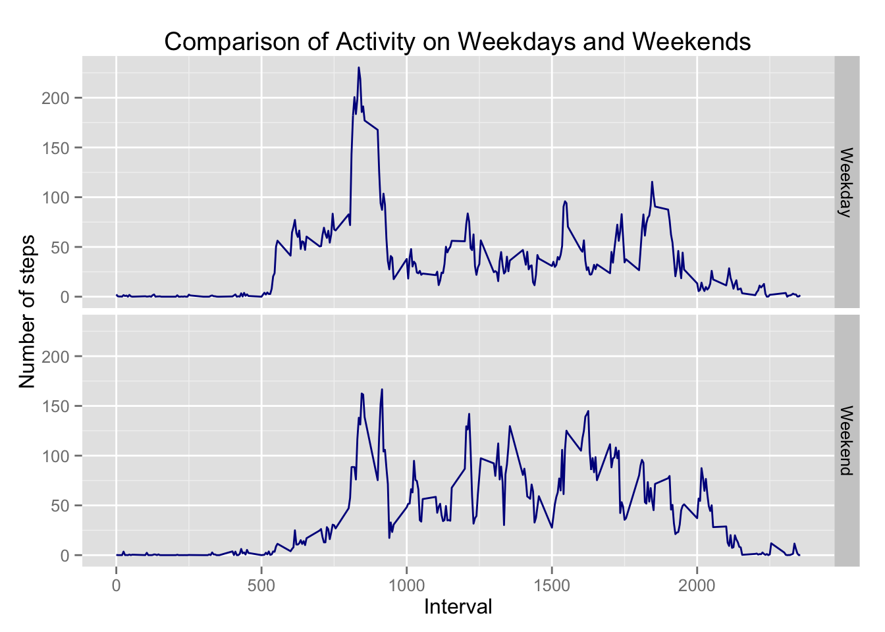

# Project 1 Report
#**Reproducible Research - Project #1, October 2014**

### Part 1 - Loading and preprocessing the data


```r
## load needed packages
library(ggplot2)
library(dplyr)
library(knitr)
library(markdown)
# Define some options for knitr and markdown
options(markdown.HTML.options = "")
knitr::opts_chunk$set(tidy=FALSE, fig.path='figures/')
```


```r
## read raw data - assumes file is already in working directory

data <- read.csv(file = "activity.csv", header = TRUE)

## transform data for the analysis, want to ignore missing values in this section
## to ignore the missing values, I filter out any days with total steps = 0
x_data <- data %.%
            group_by(date) %.%
            summarize(total_steps = sum(steps, na.rm = TRUE)) %.%
            filter(total_steps > 0)
```

### Part 2 - What is the mean total number of steps taken per day?


```r
##plot histogram
plot1 <- ggplot(x_data, aes(x=total_steps)) + 
         geom_histogram(color = "darkblue", fill = "grey", binwidth = 1000) +
         labs(x = "Total Steps per Day", y = "Number of Days")
print(plot1)
```

 

```r
## calculate the mean and median of total steps
round(mean(x_data$total_steps, na.rm = TRUE),1)
```

```
## [1] 10766.2
```

```r
median(x_data$total_steps, na.rm = TRUE)
```

```
## [1] 10765
```

This shows the total activity over the course of 61 days. We see that 10 days had activty in the range of 10,000 - 11,000 steps.  
The mean and median reported is the mean and median of the number of total steps taken across these 61 days. Later, in part 4 of the assignment, I will use the mean value of 10,766.2 to populate the missing days' data.


### Part 3 - What is the average daily activity pattern?


```r
##now look at data grouped by time interval
x_time <- data %.%
            group_by(interval) %.%
            summarize(total_steps = sum(steps, na.rm = TRUE),
                      mean_steps = round(mean(steps, na.rm = TRUE), 1))

## plot time-series of daily activity pattern on a five-minute interval
plot2 <- ggplot(x_time, aes(x=interval, y= mean_steps)) + geom_line(color = "darkblue")
print(plot2)
```

 

```r
## get max value of average steps and determine what time interval it is
x_time[which.max(x_time$mean_steps),]
```

```
## Source: local data frame [1 x 3]
## 
##     interval total_steps mean_steps
## 104      835       10927      206.2
```

We see the average time of peak activity is the 8:35 time interval. This is likely people going to work or to school.

### Part 4 - Imputing missing values


```r
summary(data)
```

```
##      steps                date          interval     
##  Min.   :  0.00   2012-10-01:  288   Min.   :   0.0  
##  1st Qu.:  0.00   2012-10-02:  288   1st Qu.: 588.8  
##  Median :  0.00   2012-10-03:  288   Median :1177.5  
##  Mean   : 37.38   2012-10-04:  288   Mean   :1177.5  
##  3rd Qu.: 12.00   2012-10-05:  288   3rd Qu.:1766.2  
##  Max.   :806.00   2012-10-06:  288   Max.   :2355.0  
##  NA's   :2304     (Other)   :15840
```

The number of missing observations can be seen via the summary function; there are 2,304 time intervals that are missing data.  
This is equivalent to 8 days of missing data 2304/288 = 8.  
The basic strategy to deal with the missing data is to find the mean number of steps taken for each time interval, and then insert that mean value into any same time interval that has an NA value.


```r
##now to populate missing data 
## find mean for each interval - ignoring NAs, gives same mean as reported in part 2
impute_data <- data %.%
                  group_by(interval) %.%
                  summarize(total_steps = sum(steps, na.rm = TRUE),
                            mean_steps = round(mean(steps, na.rm = TRUE), 1))

##initialize loop variables, and create empty data frame
i <- 0
j <- 1
final_data <- data.frame()
## build for loop to cycle through each time interval, and find/replace NAs with mean values from impute_data
for (i in x_time$interval) {
  ##insert calculated values whenever an NA is found
  temp_data <- data %.%
                  filter(interval == i) %.%
                  mutate(steps = ifelse(is.na(steps), impute_data$mean_steps[j], steps))
  
  ##rbind temp_data results to final_data and build up full results in "final_data" data frame
  final_data <- rbind(final_data, temp_data)
  
  j <- j + 1  ##increment loop counter variable by 1
}

##clean up temp data frames
rm(temp_data)
rm(impute_data)

##verify the "final_data" data frame has no missing steps values
summary(final_data)
```

```
##      steps                date          interval     
##  Min.   :  0.00   2012-10-01:  288   Min.   :   0.0  
##  1st Qu.:  0.00   2012-10-02:  288   1st Qu.: 588.8  
##  Median :  0.00   2012-10-03:  288   Median :1177.5  
##  Mean   : 37.38   2012-10-04:  288   Mean   :1177.5  
##  3rd Qu.: 27.00   2012-10-05:  288   3rd Qu.:1766.2  
##  Max.   :806.00   2012-10-06:  288   Max.   :2355.0  
##                   (Other)   :15840
```

Yes, we can see there are no longer any NAs.  Next, plot the histogram of total number of steps taken with the imputed data.


```r
x_data_new <- final_data %.%
  group_by(date) %.%
  summarize(total_steps = sum(steps, na.rm = TRUE),
            mean_steps = round(mean(steps, na.rm = TRUE), 1),
            median_steps = median(steps, na.rm = TRUE))

plot3 <- ggplot(x_data_new, aes(x=total_steps)) + 
         geom_histogram(color = "darkblue", fill = "grey", binwidth = 1000) +
         labs(x = "Total Steps per Day", y = "Number of Days")
print(plot3)
```

 

The plot shows an additional 8 days in the 10,000-11,000 steps "bucket" - makes sense as the average steps amount added to each of the eight missing days was ~ 10,766.


```r
## summary report of daily activity - mean number of steps reported in column 3 and median number of steps in column 4
summary(x_data_new)
```

```
##          date     total_steps      mean_steps     median_steps   
##  2012-10-01: 1   Min.   :   41   Min.   : 0.10   Min.   : 0.000  
##  2012-10-02: 1   1st Qu.: 9819   1st Qu.:34.10   1st Qu.: 0.000  
##  2012-10-03: 1   Median :10766   Median :37.40   Median : 0.000  
##  2012-10-04: 1   Mean   :10766   Mean   :37.39   Mean   : 4.472  
##  2012-10-05: 1   3rd Qu.:12811   3rd Qu.:44.50   3rd Qu.: 0.000  
##  2012-10-06: 1   Max.   :21194   Max.   :73.60   Max.   :34.100  
##  (Other)   :55
```

The mean of this new data set is the same as we observed in Part 2, which makes sense as I used the mean of the data set in Part 2 to populate the missing days' data. The median has changed slightly because 8 days were added with a total steps value of 10,766, so this has shifted the median to match the mean value. 

### Part 5 - Are there differences in activity patterns between weekdays and weekends?


```r
##coerce to Dates so that each day can be classified as either a "Weekday" or a "Weekend"
final_data$date <- as.Date(final_data$date)

##classify days
final_data <- final_data %.%
                mutate(dayofweek = weekdays(date, abbreviate = TRUE)) %.%
                mutate(daytype = ifelse(grepl(("Sat|Sun"),dayofweek) == TRUE,"Weekend","Weekday"))

##create summary data frame for plotting purposes
temp_data <- final_data %.%
                group_by(daytype,interval) %.%
                summarize(mean_steps = mean(steps, na.rm = TRUE))              

## make facet plot - weekend vs weekday by time interval
plot4 <- ggplot(temp_data,aes(x = interval, y = mean_steps)) + 
        geom_line(color = "darkblue") + 
        facet_grid(daytype ~.) + 
        labs(x = "Interval", y = "Number of steps", title = "Comparison of Activity on Weekdays and Weekends")
print(plot4)
```

 

We see a few differences betweeen the weekend and weekday activity:  
1. Activity starts later on the weekends.  
2. There is no peak at 8:35 during the weekends.  
3. Activity is spread out more evenly during the weekends.  
4. There is more activity after 20:00 on the weekends.
